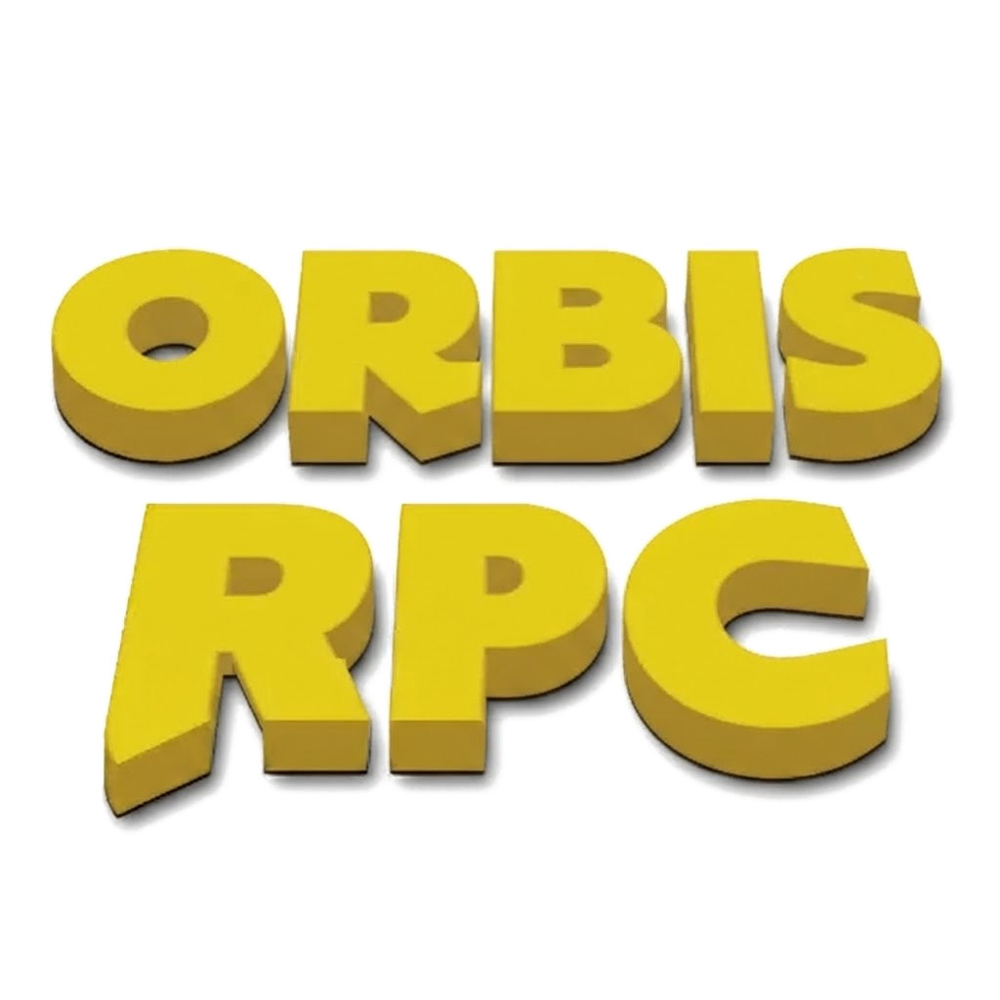

<p align="center">
  
</p>

<p align="center">
  <a href="https://github.com/SirHumza/orbisRPC/releases/tag/v1.0.0"></a>
  
  
  
</p>

<p align="center"><b>Discord Rich Presence for the jailbroken PS4 — every game, zero setup.</b><br>
A background daemon that lives entirely on your console and posts what you're
playing to Discord: name, cover art, timer. No PC at runtime.</p>

---

## Install (5 minutes)

1. Grab `OrbisRPC-Setup-1.0.0.pkg` from the
   [Releases page](https://github.com/SirHumza/orbisRPC/releases/tag/v1.0.0)
   and install it with Package Installer.
2. Open **orbisRPC Setup** → say Yes. It drops the daemon into GoldHEN's
   `bin/elf` and saves your Discord token.
3. Start **orbisrpc** from GoldHEN's payload menu, launch a game, watch Discord.

After a reboot: re-jailbreak, then enable AutoRun for `orbisrpc` in GoldHEN's
payload menu once — it starts itself on every jailbreak after that.

## What you get

| | |
|---|---|
| 🎮 **Any game, no lists** | Names resolve from your console's own database — CUSA, PPSA, indies, all covered with zero per-game setup. |
| 🖼️ **Real cover art** | Game art served per title, PlayStation logo when idle. |
| ⏱️ **True timers** | Survive reconnects and restarts, resume across quick game switches. |
| 🧠 **Self-learning** | First-seen titles are remembered, so later boots resolve instantly. |
| 🔄 **Self-updating** | Signed daemon updates with boot rollback. No reinstall treadmill. |
| 📦 **One-tap installer** | Setup PKG: install → token → payload in place. |

## How it works

```
PS4 (GoldHEN)                              Discord
┌─────────────────────────┐      ┌──────────────────┐
│ orbisRPC daemon         │ TLS  │  your profile    │
│  sandbox scan → game ID │ ◄──► │  Playing Game    │
│  app.db → display name  │      │  [cover] [timer] │
└─────────────────────────┘      └──────────────────┘
```

Details: [`docs/DAEMON.md`](docs/DAEMON.md) · [`docs/INSTALLER.md`](docs/INSTALLER.md) ·
[`docs/TROUBLESHOOTING.md`](docs/TROUBLESHOOTING.md) ·
[`docs/PRODUCTION.md`](docs/PRODUCTION.md)

## Config

Only `token` (your Discord user session token) is required —
`/data/orbisRPC/config.json`. Everything else ships working: presence text,
home art, poll interval, plus the self-learned `titles` map (hands off).

## Building

```bash
./scripts/build_sdk.sh            # daemon payload (needs ps4-payload-sdk)
make -f installer/Makefile        # Setup PKG (OpenOrbis toolchain, llvmshim)
make -C tests test                # host unit tests
make -C tests asan                # ASan/UBSan
python3 tests/e2e_consumer.py     # contracts + linkage gate
```

## Safety

A user session token grants full account access — never share the config,
never commit a real token. Token-based presence is against Discord's ToS
(standard practice for headless presence tools; risk is yours).

## License

To be finalized (MIT vs GPL). No GPL source is copied into this tree.
